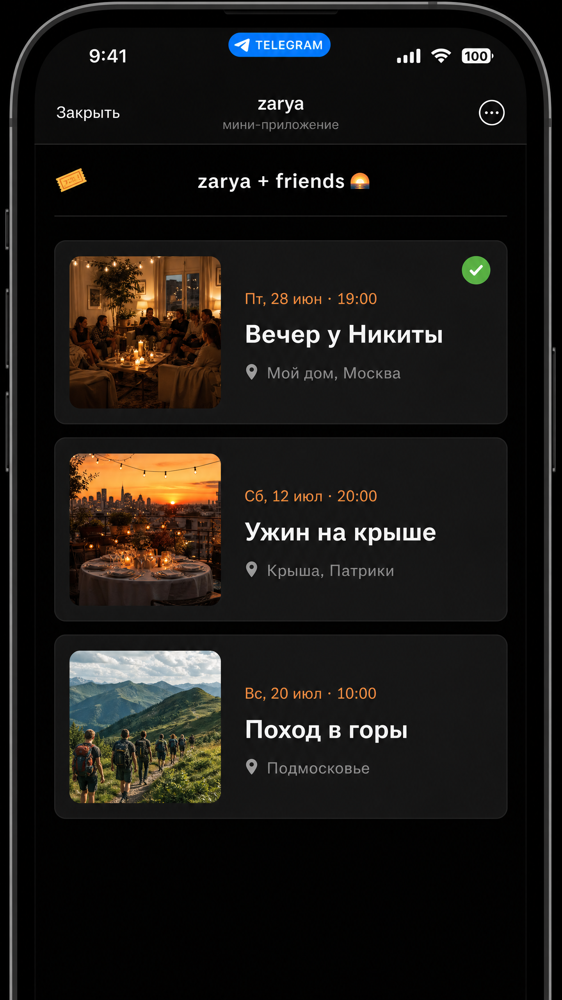

# zarya 🌅

**zarya** is a Telegram Mini App for community event management — designed for small friend groups to discover, register for, and keep track of social gatherings.



## Overview

Small friend groups often lack a centralized, low-friction way to organize recurring social events. Current solutions — WhatsApp groups, shared notes, manual messages — create friction, scattered information, and poor event discoverability.

zarya solves this by providing a single, always-accessible interface inside Telegram. Events are visible immediately upon opening the app, and registration requires just two taps. The platform is built around a home as a gathering place, starting with a close circle of friends and designed to grow naturally.

## Features (MVP)

- **Telegram Mini App:** Native-like experience inside Telegram — no separate app install required.
- **Visual Event Discovery:** Browse all upcoming events in chronological order with cover images.
- **Frictionless Registration:** 2-tap registration flow (open app → tap event → register).
- **Calendar Integration:** Export registered events to `.ics` format (Google Calendar, Apple Calendar, Outlook).
- **Admin Panel:** Manage events via Telegram bot commands — create, edit, delete, view registrations.
- **Russian Interface:** Fully localized for Russian-speaking users.

## Architecture

```
Telegram Mini App (React + TypeScript)
              ↕ REST API
         FastAPI Backend
              ↕
         PostgreSQL (Railway)
```

| Layer | Technology |
|-------|-----------|
| Frontend | React 18 + TypeScript + Telegram Web App SDK |
| Backend | FastAPI (Python 3.11) + aiogram 3.x |
| Database | PostgreSQL |
| Deployment | Railway.com (Docker) |

## Project Structure

```
zarya/
├── AGENTS.md                    # AI agent instructions (read first)
├── README.md
├── .gitignore
├── .cursor/
│   ├── rules/                   # Cursor AI behavior rules
│   └── skills/                  # Reusable agent skills
├── frontend/                    # React Telegram Mini App
├── backend/                     # FastAPI + aiogram bot
└── docs/
    ├── prd.md                   # Product Requirements Document (source of truth)
    ├── tasks.md                 # Task backlog
    ├── ux_ui_analysis.md        # UX/UI benchmarks and analysis
    ├── decisions/               # Architecture Decision Records (ADRs)
    │   ├── 001-stack.md
    │   ├── 002-ux-navigation.md
    │   └── 003-language.md
    ├── research/                # Competitor research and notes
    ├── deliverables/            # UI mockups and finalized artifacts
    └── assets/                  # Images and design assets
```

## Getting Started

*Local development setup instructions will be added once the backend and frontend scaffolding is complete (Phase 1).*

## Documentation

- [Product Requirements Document](docs/prd.md)
- [Task Backlog](docs/tasks.md)
- [UX/UI Analysis](docs/ux_ui_analysis.md)
- [ADR-001: Stack](docs/decisions/001-stack.md)
- [ADR-002: Navigation](docs/decisions/002-ux-navigation.md)
- [ADR-003: Language](docs/decisions/003-language.md)

## UI Mockups

| Screen | Preview |
|--------|---------|
| Home (event list) | [screen-01-home.png](docs/deliverables/screen-01-home.png) |
| Event details (unregistered) | [screen-02-event-details-unregistered.png](docs/deliverables/screen-02-event-details-unregistered.png) |
| Event details (registered) | [screen-03-event-details-registered.png](docs/deliverables/screen-03-event-details-registered.png) |
| My Registrations | [screen-04-my-registrations.png](docs/deliverables/screen-04-my-registrations.png) |
| Registration success | [screen-05-registration-success.png](docs/deliverables/screen-05-registration-success.png) |

---

*Built with ❤️ for the zarya community.*
